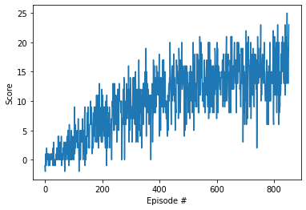

# Udacity Deep Reinforcement Learning Nanodegree - Project 1
## by Mathieu Deiber

## Learning Algorithm and Hyperparameters
For this project, we trained an agent to navigate (and collect bananas!) in a large, square world. The agent was trained using Deep Q-Network algorithm. The model and DQN scripts from the project "OpenAI Gym's LunarLander environment" were used as a starting point.

The deep neural network was implemented with Pytorch. The DQN was implemented with the following hyperparameter values:
* Batch Size: 64 (minibatch size)
* Gamma: 0.99 (discount factor)
* Tau: 0.001 (for soft update of target parameters)
* LR: 0.0005 (learning rate)
* Updatinf Rate: 4 (how often to update the network)
* Epsilon for epsilon-greedy action: decreasing from 1 to 0.01

## Model Architectures
The deep neural network was implemented with the following layers:
* Input layer of size: 37
* 1st hidden layer of size: 84
* 2nd hidden layer of size: 84
* Output layer of size: 4
*  A Relu activation function was used between the input layer and 1st hidden layer as well as between the 1st hidden layer and the 2nd hidden layer.

## Model Training

The model was trained until the average score for 100 episodes exceed 15. Based on that, the environment was solved in 753 episodes with an average score of 15.02.

## Future Ideas

The next logical step would be to implement some of the other variation of the DQN to compare the performance of the different implementation, such as:
* Double DQN
* Prioritized Experience Replay
* Dueling DQN
* Rainbow
